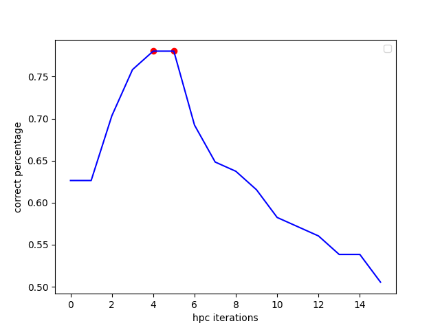
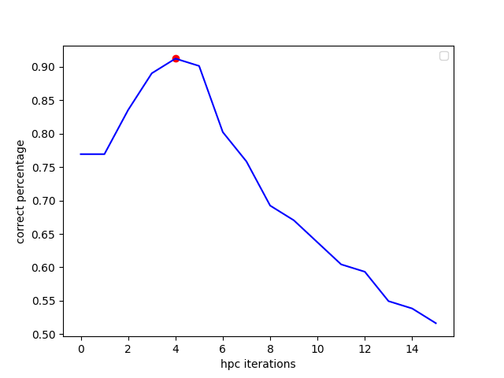

# Algorytm do wykrywania płci po głosie.

## Opis algorytmu 

1. z pliku audio pobierana jest jedna ścieżka dźwiękowa
2. ścieżka dźwiękowa jest mnożona przez okno Hanning'a
3. z pliku audio metodą szybkiej transformaty Fouriera tworzone jest widmo, z którego brany jest moduł. Dla utworzonego sygnału FFT liczona jest częstotliwość dla każdej wartości sygnału mnożąc indeks sygnału (od zera) razy $\frac{\text{częstotliwość próbkowania}}{\text{długość sygnału FFT}}$
4. następnie jest liczony `Harmonic Product Spectrum`
    - kopiowany jest sygnał do zmiennej `hpc`
	- dla `d`, gdzie jest to liczba downsamplacji algorytmu `hpc`, od $2$ do ustawionej wartości maksymalnej
		- sygnał jest downsamplowany co `d` (`downsampled = signal[::d]`)
		- następnie jest mnożony z sygnałem `hpc` (`hpc[:len(downsampled)] *= downsampled`)
1. otrzymany sygnał `hpc` jest izolowany do wartości od $50 \text{Hz}$ do $300 \text{Hz}$
2. w finalnym sygnale `hpc` szukamy częstotliwości dominującej, tj. taka częstotliwość, dla której wartość sygnału `hpc` jest jak najwyższa
3. dominująca częstotliwość jest porównywana z ustaloną wartością progową, jeśli jest mniejsza niż wartość progowa, wtedy płeć jest ustalana jako mężczyzna, inaczej jako kobieta
## Wyniki początkowe i opytmalizacjia
Na początku wykonałem analizę wyżej opisanego algorytmu bez kroku 6. To znaczy, częstotliwość dominującą z sygnału `hpc` pobierałem z całego spektrum widma.

Przedstawiony wykres ukazuje procent trafności algorytmu w zależności od użytej maksymalnej ilości downsamplacji. Wartość progowa do ustalania płci została ustawiona iteracyjnie od $80$ do $250$ z krokiem co $0.001$, tak aby zmaksymalizować skuteczność. Analiza została wykonana na 91 próbkach danych.

Algorytm uzyskał najwyższą wartość skuteczności $78.02$% dla wartości
1. ilość downsamplacji = $4$ oraz wartość progowa płci $172.698$
2. ilość downsamplacji = $5$ oraz wartość progowa płci $168.977$

Macierz pomyłek dla pierwszego wyniku.

  

|                                 | Przewidywana klasa Kobieta | Przewidywana klasa Mężczyzna |
| ------------------------------- | -------------------------- | ---------------------------- |
| **Rzeczywista klasa Kobieta**   | $28$                       | $18$                         |
| **Rzeczywista klasa Mężczyzna** | $2$                        | $43$                         |
  
# Wyniki finalne

W finalnym algorytmie krok 6. został uwzględniony. Jako, że zakres częstotliwości sygnału audio jest duży, a my chcemy wykrywać głos ludzki, sygnał `hpc` zostaje odizolowany od $50\text{Hz}$ do $300\text{Hz}$ aby zakres ten na pewno uwzględniał częstotliwość podstawową tonu krtaniowego.

  

Algorytm uzyskał najwyższą wartość skuteczności $91.21$% dla wartości
1. ilość downsamplacji = $4$ oraz wartość progowa płci $172.698$

Macierz pomyłek.

|                                 | Przewidywana klasa Kobieta | Przewidywana klasa Mężczyzna |
| ------------------------------- | -------------------------- | ---------------------------- |
| **Rzeczywista klasa Kobieta**   | $40$                       | $6$                          |
| **Rzeczywista klasa Mężczyzna** | $2$                        | $43$                         |
  

Izolacja częstotliwości pomogła znacznie zmniejszyć błędy w przypadku, kiedy mówi kobieta.